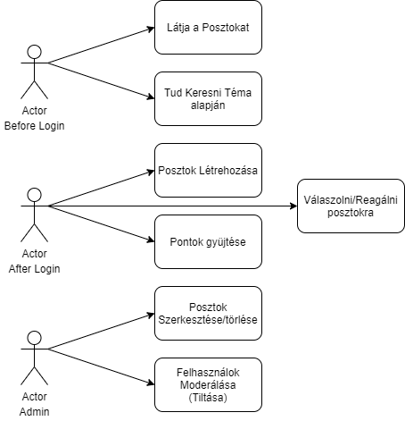

# Követelmény-specifikáció

## 1. Áttekintés

A rendszer célja egy olyan webes felület biztosítása, ahol a felhasználók kérdéseket tudnak feltenni, melyekre más felhasználók válaszolhatnak. A kérdések kategóriák szerint jelennek meg. Az alkalmazás támogasson light/dark módot, GitHub fiókkal történő bejelentkezést.

## 2. Jelenlegi helyzet

A kategóriában már népszerű weboldalak:

- [Yahoo Answers](https://answers.yahoo.com/): Általános célú, angol nyelvű. Több, mint 25 kategóriában lehet kérdezni. Mindenki számára nyitott, ezért a válaszok minősége is változó.
- [Stack Exchange](https://stackexchange.com/): Tudományos, illetve szakmai témákban lehet szakértők segítségét kérni. Több al-oldalból áll, ezek közül néhány fontosabb:
    - [Stack Overflow](https://stackoverflow.com/): Minden programozó ismeri, ha valamilyen hibába fut, első dolga Stack Overflow-on megnézni, másnál is előfordult-e, és ha igen, hogyan oldotta meg.
    - [Super User](https://superuser.com/): Rendszerüzemeltetéssel kapcsolatos problémák megoldásában találhatunk segítséget.
    - Ezeken kívül van kihez fordulnunk akkor is, ha [kriptográfiával](https://crypto.stackexchange.com/), [kertészkedéssel](https://gardening.stackexchange.com/) vagy [kínai nyelvtanulással](https://chinese.stackexchange.com/) kapcsolatos kérdéseink merülnének fel. Az összes oldal listája [itt](https://stackexchange.com/sites) megtalálható.
- [Gyakori Kérdések](https://www.gyakorikerdesek.hu/): A legnagyobb magyar nyelvű Q&A oldal. Sajnos a rossz minőségű kérdések és válaszok miatt ismert.

## 3. Vágyálom rendszer

A projekt célja egy online Question-Answer (kérdés-válasz) oldal létrehozása. Lehessen kérdést feltenni, válaszolni azokra, keresni kategória szerint, háttér témát változtatni (light, dark) a weboldalon. Socialmedia/github fiókokkal lehessen bejelentkezni. Bejelentkezés nélkül is meg lehessen nézni a kérdéseket és a hozzájuk tartozó válaszokat, viszont a kérdés feltétel, válasz adás (posztolás) bejelentkezéshez legyen kötve. A válaszokat lehessen minősíteni, amely által egy felhasználó tudjon pontokat gyűjteni. Minél több egy felhasználó pontja, annál magasabb rangot kaphasson. Admin joggal lehessen törölni, szerkeszteni, moderálni a nem megfelelő kérdéseket/válaszokat, felhasználókat letiltani az oldalról, a többi felhasználó jogosultságait módosítani.

## 4. Funkcionális követelmények

1. Bejelentkezési felület
2. Regisztrációs felület
3. Posztolás:
    - Kérdés feltétel
    - Válasz adás
4. Kategória szerinti keresés
5. Válaszok minősítése
    - válaszok minősítése like-al, illetve dislike-al
6. Pontok gyűjtése
    - a felhasználó pontokat gyűjthet a válaszaival
    - minél több pontot gyűjt a felhasználó, annál magasabb rangot kap

### Adminisztrátor jogosultsággal rendelkezők:
1. Nem megfelelő kérdések törlése, szerkesztése és moderálása
2. Nem megfelelő válaszok törlése, szerkesztése és moderálása
3. Felhasználók letiltása az oldalról
4. Felhasználók jogosultságainak módosítása

### Jogosultságok:
- Vendég
- Felhasználó
- Admin

## 5. Rendszerre vonatkozó követelmények, szabályok

### Front end (Next.js)
- HTML
- CSS, SCSS
- JS, jQuery
- Bootstrap
- Font Awesome
- Google Fonts
- Google Ads

### Back end
- Laravel framework (PHP)
- SQL - MongoDB

## 6. Üzleti folyamatok modelje

## 7. Fogalomszótár
Fogalom | Leírás
--- | ---
HTML (HyperText MarkUp Langage) | A weboldalak tartalmának leírására használt jelölő nyelv. [Szabvány](https://www.w3.org/standards/webdesign/htmlcss). 
CSS (Cascading Style Sheets) | A weboldalak formázásához használt jelölő nyelv. [Szabvány](https://www.w3.org/standards/webdesign/htmlcss).
JavaScript / JS | Egy, a webböngészőben futó programok írására is alkalmas programozási nyelv. A projektben az interaktivítás növeléséhez használjuk.
Webböngésző | Az a szoftver, amelyen keresztül a felhasználó weboldalakat képes meglátogatni, azok tartalmával interakcióba lépni. Ilyen például a Google Chrome, Firefox.
jQuery | Egy JavaScript függvénykönyvtár, mely a weboldalak HTML és CSS elemeinek dinamikus változtatását teszi egyszerűbbé, ezzel meggyorsítva a fejlesztést
Függvénykönyvtár | Olyan előre megírt kódok, szoftverkomponensek, melyek más szoftver fejlesztéséhez felhasználhatók.
Bootstrap | Egy CSS keretrendszer, mely előre megírt formázásokat és praktikus elrendezéseket biztosít. Nagymértékben felgyorsítja a fejlesztést.
Keretrendszer / Framework | Olyan szoftvertermék, amely más szoftverek alapjául szolgálhat. Az adott szoftvertípusra jellemző közös komponenseket már eleve tartalmazza, így gyorsabbá téve a projektek elkészítését.
Font Awesome | Egy ikonokat tartalmazó font-csomag. Könnyű és gyors hozzáférést biztosít gyakran használt felületi ikonokhoz.
Google Fonts | Egy internetes szolgáltatás, amely rengeteg különböző, ingyen használható betűtípust tesz elérhetővé.
Google Ads | Egy online hirdetési platform.
PHP | Egy szerver oldali programozási nyelv. A backend elkészítésében alkalmazzuk.
Laravel | Egy PHP keretrendszer, melyet webalkalmazások készítésére fejlesztettek ki.
Front end | A szoftver azon része, amellyel a felhasználó interakcióba tud lépni. Az adatokat valamilyen felületen jeleníti meg, ezzel a felülettel azonosítjuk a front endet.
Back end | A szoftver azon része, amely a felhasználóval közvetlenül nem, csak a front enden keresztül érintkezik. A back end feladata a különböző erőforrásokkal, például adatbáziskezelő rendszerekkel való kommunikáció. Felfogható az adatbázis és a front end közötti közvetítő rétegként.
SQL (Structured Query Langauage) | Adatbázisrendszerekben használt nyelv, adatlekérdezések megfogalmazására
MongoDB | Egy NoSQL típusú adatbáziskezelő rendszer. JSON objektumokat használ az adattárolásra.
NoSQL (Not Only SQL) | A hagyományos (SQL-alapú, vagy relációs) adatbázisrendszerektől eltérő rendszerek
JSON (JavaScript Object Notation) | Egy adatközlő formátum, amely a JavaScript nyelv object adattípusán alapul.

## 8. Adatbázis terv