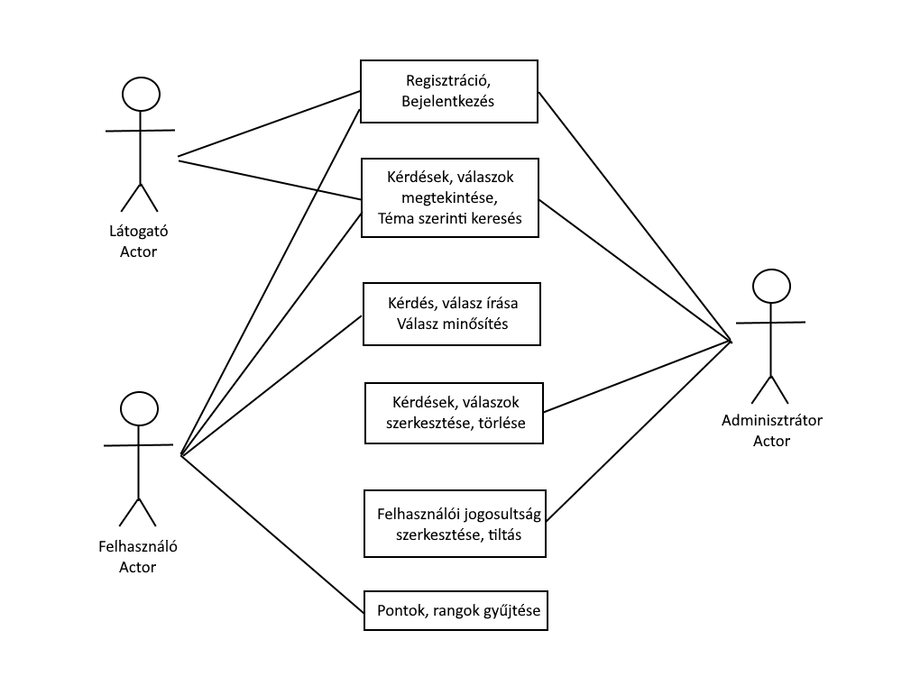

# Rendszerterv

## 1. A rendszer célja

A rendszer célja egy olyan webes felület biztosítása, ahol a felhasználók kérdéseket tudnak feltenni, melyekre más felhasználók válaszolhatnak. A kérdések kategóriák szerint jelennek meg.
Az oldalra social media (GitHub) fiókkal lehet bejelentkezni/regisztrálni. A kérdéseket és válaszokat az adminok moderálják, a nem megfelelő posztok törlésre kerülnek.
A felhasználók a kérdésekre és válaszokra gombnyomással adhatnak pozitív, illetve negatív visszajelzést (like-dislike/upvote-downvote).
A rendszer webes felületen érhető el.

## 2. Projektterv

Szerepkörök:

	Front end: Jámbor Alexandra, Vincze Flórián
	
	Back end: Árvai Dániel

## 3. Ütemterv

Trello: https://trello.com/b/zGA3eTkt/nao-afp2

&nbsp;&nbsp;&nbsp;&nbsp; 1. gyakorlat: Funkcionális és Követelmény specifikáció

&nbsp;&nbsp;&nbsp;&nbsp; 2. gyakorlat: Rendszerterv

&nbsp;&nbsp;&nbsp;&nbsp; 3. gyakorlat: Fejlesztés megkezdése (Adatbázis kialakítása)

&nbsp;&nbsp;&nbsp;&nbsp; 4-5. gyakorlat: Fejlesztés (Backend funkciók elkészítése)

&nbsp;&nbsp;&nbsp;&nbsp; 6-7. gyakorlat: Fejlesztés (Frontend funkciók kialakítása)

&nbsp;&nbsp;&nbsp;&nbsp; 8-9. gyakorlat: Fejlesztés (Felhasználói felület kialakítása + Tesztelés megkezdése)

&nbsp;&nbsp;&nbsp;&nbsp; 10-11. gyakorlat: Tesztelés (Integrációs teszt)

&nbsp;&nbsp;&nbsp;&nbsp; 12. gyakorlat: Projekt befejezése, Bemutatás

## 4. Üzleti folyamatok modellje

## 5. Követelmények

### Funkcionális követelmények:
- Felhassználók adatait tudjuk tárolni.
- Webes környezeten való működés.
- Kategória szerinti keresés
- Válaszok minősítése
	- válaszok minősítése like-al, illetve dislike-al
- Kategória szerinti keresés

### Nem funkcionális követelmények:
- A felhasználók csak a saját bejegyzéseiket tudják módosítani/törölni de a többi felhasználóét is meg tudják tekinteni.
- Pontok gyűjtése
	- a felhasználó pontokat gyűjthet a válaszaival
	- minél több pontot gyűjt a felhasználó, annál magasabb rangot kap
	
## 6. Funkcionális terv

A rendszerben szereplő felhasználóknak kétféle szerepkörük lesz, ez az adminisztrátor és a felhasználó.
Az admin minden felhasználó tevékenységét nyomon tudja követni és adott esetben moderálhatja módosíthatja/eltávolíthatja egy-egy user posztját.
A felhasználók csak a saját posztjaikat tudják eltávolítani/módosítani, a többi user-ét csak megtekinthetik és válaszolhatnak rá illetve reagálhatnak rá.

### Menü felépítés:
### Nyitóoldal
- Bejelentkezés
- Regisztráció
- Segítség
	
### Bejelentkezve
- Profil
- Posztok
- Főoldal
- Segítség
- Kijelentkezés

## 7. Fizikai környezet

Az alkalmazás webes felületre készül. Feltételezzük, hogy a számítógépen van telepítve valamilyen böngésző(Google Chrome, Mozilla Firefox, Microsoft Edge,Opera).

### Fejlesztői eszközök:
- Notepad++
- Visual  Studio/Code
- Wamp/Xampp server
- Node
- PhpMyAdmin
	

## 8. Architekturális terv

### Backend

A backendhez szükség van egy adatbázis szerverre, ebben az esetben MongoDB-t használunk. A szerver oldalon egy Laravel (PHP) alkalmazás fut, amely az adatbázishoz csatlakozik és a beérkező HTTP lekérdezéseket kiszolgálja.
A Laravel egy MVC (Model-View-Controller) framework, ebből az adatbázis alkotja a Modelt, a backend kód pedig a Controllert.

### Frontend

A frontendet BootStrappel formázott, JavaScript és jQuery kódot tartalmazó, a HTML5 szabványt követő oldalak alkotják, melyeket a szerver oldali Laravel MVC framework nézetei (View) valósítanak meg.

## 10. Implementációs terv

A webes felület főként HTML, CSS, és Javascript nyelven fog készülni. Használjuk továbbá a jQuery nevű JavaScript framework-öt is.

Az alkalmazás az MVC tervezési mintát használó Laravel keretrendszerre épül, így jól elkülöníthőek az egyes komponensek. Minden View, Controller és Model osztály külön fájlba kerül, a három komponens-kategóriának pedig a keretrendszer saját mappát hoz létre.

## 11. Tesztterv

A backend tesztelését külön is elvégezzük, ezen kívűl integrációs teszteket is csinálunk.

## Backend - Unit test

A Controllerek metódusain unit tesztelést végzünk. Ehhez a Laravel által is támogatott PHPUnit teszt framework-öt használjuk.
Törekszünk a minél nagyobb kód lefedettségre. Akár már fejlesztés idő alatt is írhatunk unit teszteket, sőt, ez ajánlott is a fejlesztőknek, mivel hamarabb fény derül a hibákra.
A teszt akkor sikeres, ha minden unit teszt hiba nélkül fut le.

## Integrációs teszt

Az integrációs teszt során azt ellenőrizzük, hogy a szoftver egyes komponensei képesek-e együttes működésre, jelen esetben ez a backend-frontend és a frontend-adatbázis közötti kommunikációt jelenti.
